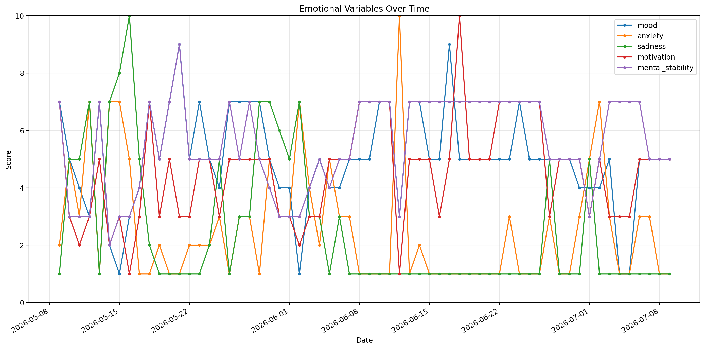
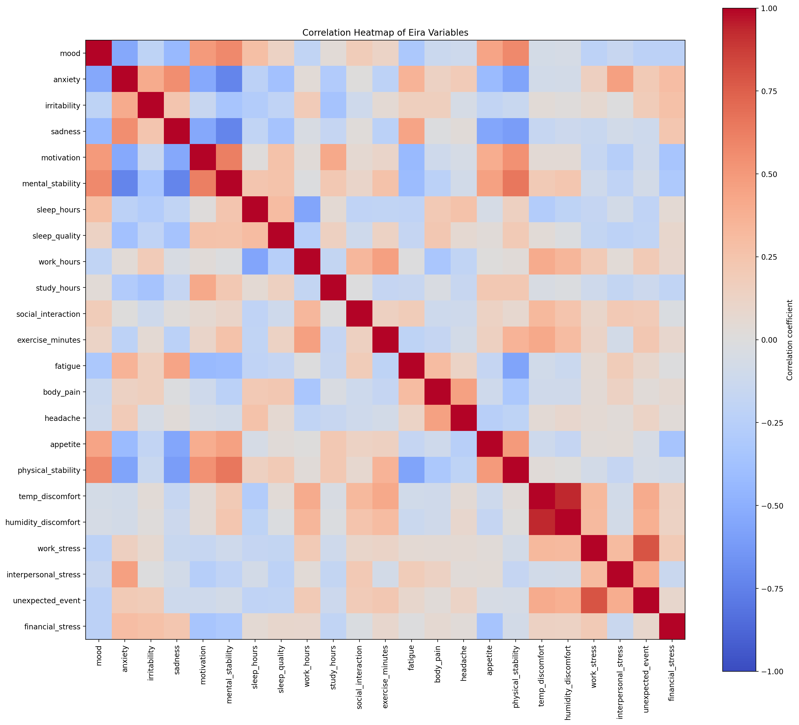

# Eira System

Eira System is a long-term AI research project exploring the development of an AI-based risk prediction system.

The project's long-term vision is to investigate whether AI can identify early warning signs before critical situations occur by integrating emotional, physical, behavioral, environmental, and life-event data.

This repository documents the early stages of the project's development and shares the first dataset collected for the Eira System project.

Many critical events begin with subtle changes that people often overlook. Eira System explores whether AI can recognize these changes earlier by treating emotions, physical conditions, behavior, and everyday experiences as measurable variables.

---

# Research Concept

One of the central ideas behind Eira System is to treat emotions as quantifiable variables rather than purely subjective experiences.

The project transforms emotional states into structured data and analyzes them alongside physical condition, behavior, environmental factors, and life events.

Its objective is to investigate whether emotional variables can improve AI-based risk prediction by helping AI detect subtle warning signs before risks become critical.

Rather than treating emotions as abstract feelings, Eira System models them as measurable variables that can be analyzed together with other real-world data.

---

# First Dataset

This repository contains the first longitudinal dataset collected for the Eira System project.

The dataset was created to establish a foundation for future AI models by recording daily changes in emotional, physical, behavioral, and environmental variables.

Current variables include:

- Emotional variables
- Physical condition
- Sleep
- Menstrual cycle
- Daily activities
- Weather
- Stress events
- Personal notes

---

# Long-Term Vision

Eira System aims to establish a new approach to AI-based risk prediction by integrating emotional variables with physical, behavioral, and environmental data.

The long-term goal is to build AI capable of discovering hidden relationships, recognizing subtle warning signs, and predicting potential risks before they become critical.

---

# Current Status

- ✅ Public GitHub repository
- ✅ Initial longitudinal dataset
- ✅ Python-based exploratory analysis
- 🚧 Statistical analysis
- 🚧 AI model development
- 🚧 Risk prediction research

---

# Initial Findings

Based on the first longitudinal dataset, several preliminary relationships were observed.

- Mental stability showed a strong negative correlation with anxiety.
- Mental stability showed a strong negative correlation with sadness.
- Motivation showed a positive correlation with mental stability.
- Mood showed a moderate negative correlation with anxiety.

These findings are exploratory and are based on a single-subject longitudinal dataset.

Future research will evaluate whether these relationships remain consistent as the dataset grows.

---

# Visualization

## Emotional Variables

## Correlation Analysis

---

# Project Status

This repository is actively under development.

Additional datasets, statistical analyses, visualizations, and AI models will be added over time as the Eira System project evolves.

---

# License

MIT License
